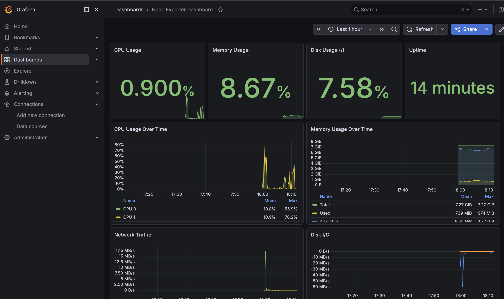

<div align="center">
  <a href="https://nirvanalabs.io">
    
  </a>

  [Sign Up](https://nirvanalabs.io/sign-up) · [Docs](https://docs.nirvanalabs.io) · [API](https://docs.nirvanalabs.io/api) · [Examples](https://github.com/nirvana-labs-examples) · [Terraform](https://registry.terraform.io/providers/nirvana-labs/nirvana/latest) · [TypeScript SDK](https://www.npmjs.com/package/@nirvana-labs/nirvana) · [Go SDK](https://github.com/Nirvana-Labs/nirvana-go) · [CLI](https://github.com/nirvana-labs/nirvana-cli) · [MCP](https://www.npmjs.com/package/@nirvana-labs/nirvana-mcp)
</div>

---

# Prometheus & Grafana on Nirvana Labs

Terraform & Ansible example for deploying a Prometheus and Grafana monitoring stack on Nirvana Labs.



## Architecture

```
+-----------------------------------------------------+
|                      Single VM                      |
|                                                     |
|  +---------------+      +----------------------+    |
|  |    Grafana    |<-----|     Prometheus       |    |
|  |     :3000     |      |       :9090          |    |
|  +---------------+      +----------+-----------+    |
|                                    |                |
|                         +----------v-----------+    |
|                         |    Node Exporter     |    |
|                         |        :9100         |    |
|                         +----------------------+    |
|                                                     |
+-----------------------------------------------------+
```

- **Prometheus**: Time-series database and monitoring system
- **Grafana**: Visualization and dashboarding
- **Node Exporter**: System metrics exporter

## Prerequisites

- [Terraform](https://www.terraform.io/downloads.html) >= 1.0
- [Ansible](https://docs.ansible.com/ansible/latest/installation_guide/intro_installation.html) >= 2.9
- [Nirvana Labs API Key](https://console.nirvanalabs.io)
- SSH key pair

## Quick Start (Automated)

### 1. Configure Terraform

```bash
cd terraform

cat > terraform.tfvars << EOF
project_id     = "your-project-id"
ssh_public_key = "ssh-ed25519 AAAA... user@host"
EOF

export NIRVANA_LABS_API_KEY="your-api-key"
```

### 2. Deploy Infrastructure

```bash
terraform init
terraform apply
```

### 3. Generate Ansible Inventory

```bash
cd ..
chmod +x scripts/generate-inventory.sh
./scripts/generate-inventory.sh
```

### 4. Run Ansible Playbook

```bash
cd ansible
ansible-playbook playbook.yml
```

### 5. Access Dashboards

- **Grafana**: `http://<PUBLIC_IP>:3000` (admin / check `/root/monitoring_credentials.txt`)
- **Prometheus**: `http://<PUBLIC_IP>:9090`

## Manual Installation

### 1. Install Node Exporter

```bash
# Create user
sudo useradd --no-create-home --shell /bin/false node_exporter

# Download and install
cd /tmp
wget https://github.com/prometheus/node_exporter/releases/download/v1.7.0/node_exporter-1.7.0.linux-amd64.tar.gz
tar xzf node_exporter-1.7.0.linux-amd64.tar.gz
sudo cp node_exporter-1.7.0.linux-amd64/node_exporter /usr/local/bin/

# Create systemd service
sudo tee /etc/systemd/system/node_exporter.service << EOF
[Unit]
Description=Node Exporter
After=network.target

[Service]
User=node_exporter
ExecStart=/usr/local/bin/node_exporter

[Install]
WantedBy=multi-user.target
EOF

sudo systemctl daemon-reload
sudo systemctl enable --now node_exporter
```

### 2. Install Prometheus

```bash
# Create user and directories
sudo useradd --no-create-home --shell /bin/false prometheus
sudo mkdir -p /etc/prometheus /var/lib/prometheus
sudo chown prometheus:prometheus /etc/prometheus /var/lib/prometheus

# Download and install
cd /tmp
wget https://github.com/prometheus/prometheus/releases/download/v2.50.1/prometheus-2.50.1.linux-amd64.tar.gz
tar xzf prometheus-2.50.1.linux-amd64.tar.gz
sudo cp prometheus-2.50.1.linux-amd64/{prometheus,promtool} /usr/local/bin/
sudo cp -r prometheus-2.50.1.linux-amd64/{consoles,console_libraries} /etc/prometheus/

# Configure Prometheus
sudo tee /etc/prometheus/prometheus.yml << EOF
global:
  scrape_interval: 15s

scrape_configs:
  - job_name: 'prometheus'
    static_configs:
      - targets: ['localhost:9090']
  - job_name: 'node_exporter'
    static_configs:
      - targets: ['localhost:9100']
EOF

# Create systemd service
sudo tee /etc/systemd/system/prometheus.service << EOF
[Unit]
Description=Prometheus
After=network.target

[Service]
User=prometheus
ExecStart=/usr/local/bin/prometheus \\
  --config.file=/etc/prometheus/prometheus.yml \\
  --storage.tsdb.path=/var/lib/prometheus

[Install]
WantedBy=multi-user.target
EOF

sudo systemctl daemon-reload
sudo systemctl enable --now prometheus
```

### 3. Install Grafana

```bash
# Add repository
curl -fsSL https://apt.grafana.com/gpg.key | sudo gpg --dearmor -o /usr/share/keyrings/grafana.gpg
echo "deb [signed-by=/usr/share/keyrings/grafana.gpg] https://apt.grafana.com stable main" | sudo tee /etc/apt/sources.list.d/grafana.list

# Install
sudo apt update && sudo apt install -y grafana

# Start
sudo systemctl enable --now grafana-server
```

## Adding More Targets

Edit `/etc/prometheus/prometheus.yml` to add more scrape targets:

```yaml
scrape_configs:
  - job_name: 'node_exporter'
    static_configs:
      - targets:
          - 'localhost:9100'
          - '10.0.0.2:9100'
          - '10.0.0.3:9100'
```

Then reload Prometheus:
```bash
sudo systemctl reload prometheus
```

## Recommended Grafana Dashboards

Import these dashboards from grafana.com:

| Dashboard ID | Name | Description |
|--------------|------|-------------|
| 1860 | Node Exporter Full | Comprehensive system metrics |
| 11074 | Node Exporter for Prometheus | Alternative system dashboard |
| 3662 | Prometheus 2.0 Overview | Prometheus self-monitoring |

To import: Grafana → Dashboards → Import → Enter ID

## Configuration

### Ansible Variables

| Variable | Default | Description |
|----------|---------|-------------|
| `prometheus_version` | `2.50.1` | Prometheus version |
| `node_exporter_version` | `1.7.0` | Node Exporter version |
| `prometheus_port` | `9090` | Prometheus port |
| `grafana_port` | `3000` | Grafana port |

### Terraform Variables

| Variable | Default | Description |
|----------|---------|-------------|
| `instance_type` | `n1-standard-2` | VM instance type |
| `boot_volume_size` | `64` | Boot volume size in GB |

## Ports

| Port | Service |
|------|---------|
| 22 | SSH |
| 3000 | Grafana |
| 9090 | Prometheus |
| 9100 | Node Exporter |

## Cleanup

```bash
cd terraform
terraform destroy
```

## Resources

- [Prometheus Documentation](https://prometheus.io/docs/)
- [Grafana Documentation](https://grafana.com/docs/)
- [Node Exporter Guide](https://prometheus.io/docs/guides/node-exporter/)
- [Nirvana Labs Documentation](https://docs.nirvanalabs.io)
